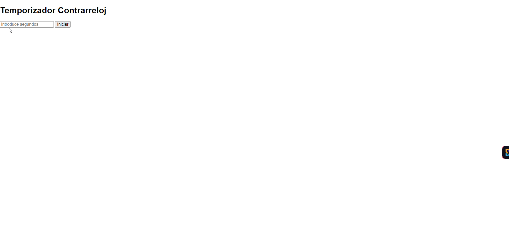
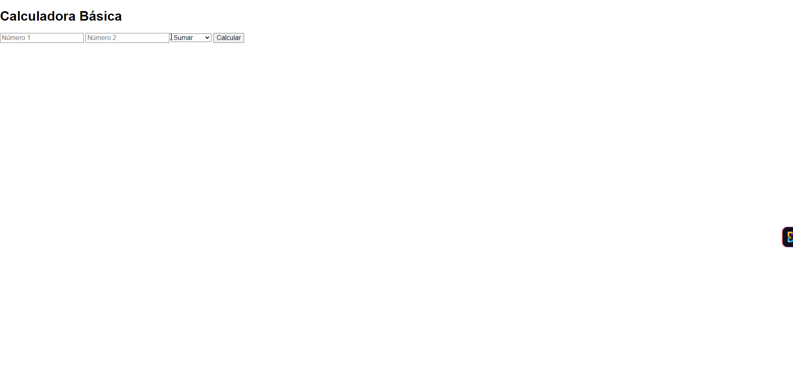
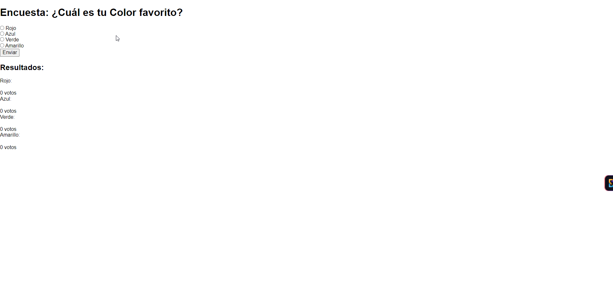
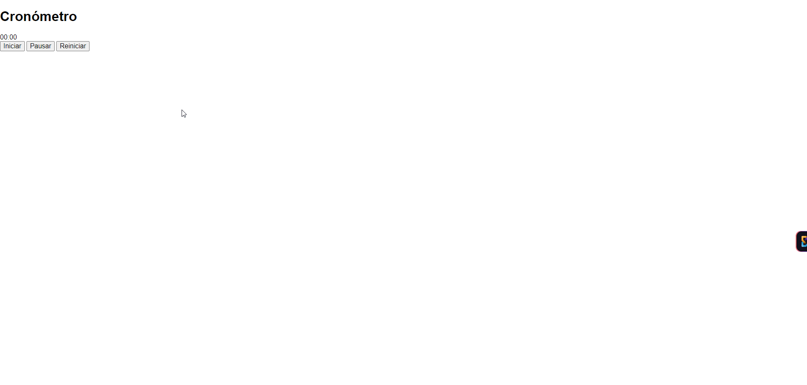
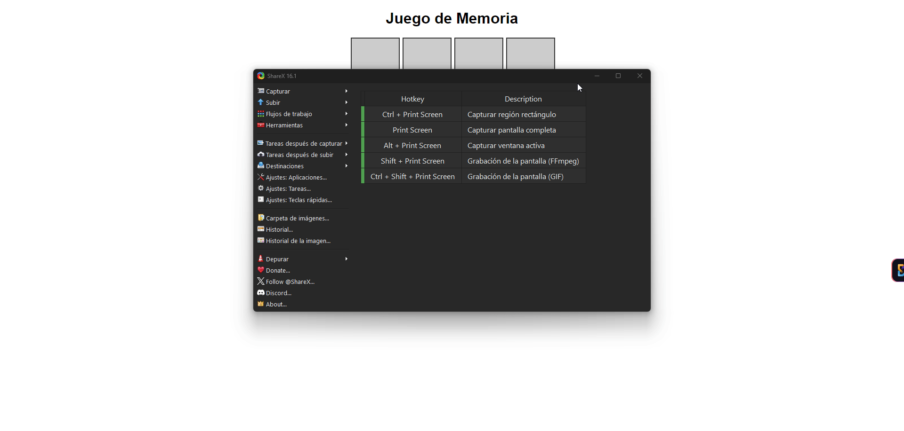
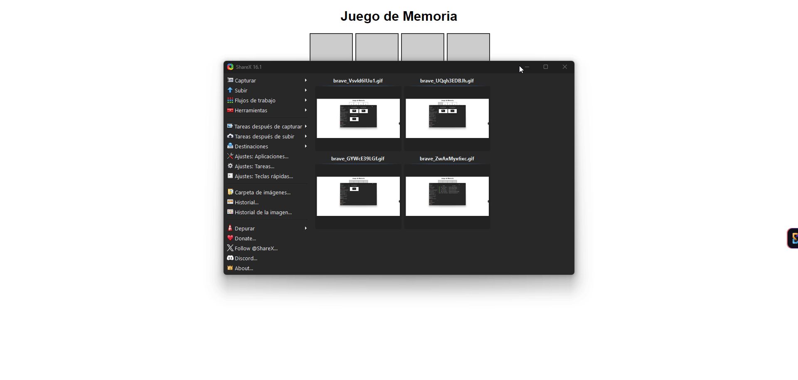
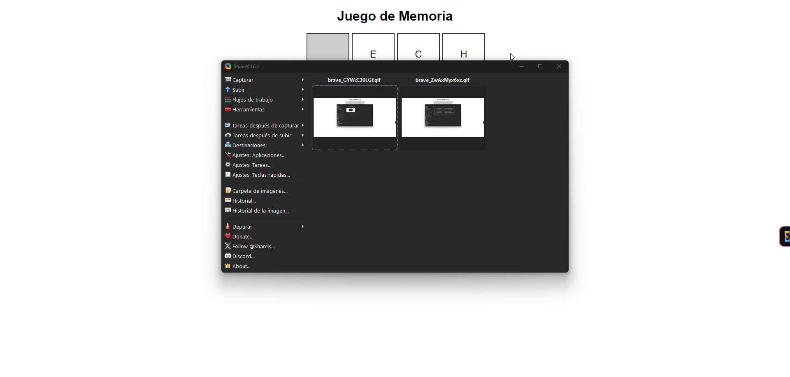
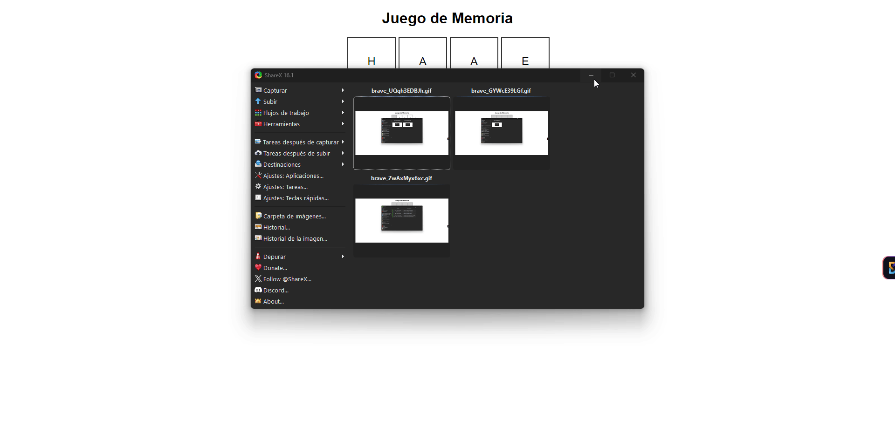

# Ejercicios de Desarrollo Web

## Ejercicio 1: Contrarreloj

### Análisis del problema:
Se requiere una página web que contenga un campo para ingresar una cantidad de segundos y un botón etiquetado "Iniciar". Al hacer clic en el botón, debe comenzar una cuenta regresiva desde el número ingresado. Al llegar a cero, debe mostrarse un mensaje que diga "¡Tiempo finalizado!". El objetivo es proporcionar una herramienta útil para medir el tiempo de manera visual e interactiva.

### Diseño de la propuesta de solución:
1. **Estructura HTML**: Un campo de entrada para los segundos, un botón "Iniciar" y un área para mostrar el tiempo restante.
2. **Lógica JavaScript**: Detectar el evento `click` en el botón y usar `setInterval` para realizar la cuenta regresiva.
3. **Diagrama de flujo**:
   - Inicia -> Ingresar segundos -> Clic en "Iniciar" -> Iniciar cuenta regresiva -> Mostrar tiempo restante -> Fin.

### Implementación del diseño propuesto:
Se desarrollará un archivo HTML que incluya un campo de entrada, un botón y un script de JavaScript que maneje la lógica de la cuenta regresiva, actualizando el tiempo en la página cada segundo hasta llegar a cero.

### Pruebas de la resolución del problema:
Pruebas realizadas manualmente ingresando 2 y 4 segundos, y verificando que el temporizador cuenta correctamente y muestra el mensaje "¡Tiempo finalizado!" al finalizar. Se adjuntarán GIFs mostrando la interacción.

---

## Ejercicio 2: Calculadora básica

### Análisis del problema:
Se requiere una página web que permita a los usuarios realizar operaciones matemáticas básicas (suma, resta, multiplicación y división) entre dos números. El objetivo es ofrecer una herramienta simple y rápida para realizar cálculos.

### Diseño de la propuesta de solución:
1. **Estructura HTML**: Dos campos de entrada para los números, un menú desplegable para seleccionar la operación, un botón "Calcular" y un área para mostrar el resultado.
2. **Lógica JavaScript**: Detectar el evento `click` en el botón "Calcular", capturar los valores y realizar la operación seleccionada.
3. **Diagrama de flujo**:
   - Inicia -> Ingresar números -> Seleccionar operación -> Clic en "Calcular" -> Mostrar resultado -> Fin.

### Implementación del diseño propuesto:
Se desarrollará un archivo HTML que incluya dos campos de entrada, un menú de selección y un script de JavaScript para manejar los cálculos y mostrar el resultado.

### Pruebas de la resolución del problema:
Pruebas realizadas manualmente para cada operación (suma, resta, multiplicación, división) y verificando que los resultados son correctos. Se adjuntarán GIFs mostrando la interacción.

---

## Ejercicio 3: Encuesta con gráficos de resultados

### Análisis del problema:
Se requiere una página web que presente una encuesta simple donde los usuarios puedan seleccionar una opción entre varias. Al enviar la respuesta, se deben mostrar los resultados en un gráfico de barras que se actualice dinámicamente. El objetivo es recopilar y visualizar opiniones de los usuarios de manera interactiva.

### Diseño de la propuesta de solución:
1. **Estructura HTML**: Pregunta con opciones (radio buttons), un botón "Enviar", y un área para mostrar el gráfico de barras.
2. **Lógica JavaScript**: Detectar el evento `click` en el botón "Enviar", contar las respuestas y actualizar el gráfico.
3. **Diagrama de flujo**:
   - Inicia -> Seleccionar opción -> Clic en "Enviar" -> Contar votos -> Actualizar gráfico -> Fin.

### Implementación del diseño propuesto:
Se desarrollará un archivo HTML con los elementos necesarios y un script de JavaScript que maneje la recolección de respuestas y la actualización del gráfico.

### Pruebas de la resolución del problema:
Pruebas realizadas manualmente seleccionando opciones y verificando que el gráfico se actualiza correctamente. Se adjuntarán GIFs mostrando la interacción.

---

## Ejercicio 4: Cronómetro con controles de inicio, pausa y reinicio

### Análisis del problema:
Se requiere una página web que contenga un cronómetro que permita al usuario iniciarlo, pausarlo y reiniciarlo. El cronómetro debe mostrar el tiempo transcurrido en minutos y segundos. El objetivo es ofrecer una herramienta útil para medir el tiempo de manera interactiva.

### Diseño de la propuesta de solución:
1. **Estructura HTML**: Botones "Iniciar", "Pausar", "Reiniciar" y un área para mostrar el tiempo.
2. **Lógica JavaScript**: Detectar eventos `click` en los botones y usar `setInterval` para actualizar el cronómetro.
3. **Diagrama de flujo**:
   - Inicia -> Clic en "Iniciar" -> Contar tiempo -> Clic en "Pausar" -> Detener conteo -> Clic en "Reiniciar" -> Volver a cero -> Fin.

### Implementación del diseño propuesto:
Se desarrollará un archivo HTML con los botones y un script de JavaScript que maneje la lógica del cronómetro y la actualización del tiempo.

### Pruebas de la resolución del problema:
Pruebas realizadas manualmente para cada botón, verificando el funcionamiento del cronómetro. Se adjuntarán GIFs mostrando la interacción.

---

## Ejercicio 5: Juego de memoria con cartas

### Análisis del problema:
Se requiere una página web que presente un juego de memoria donde el usuario deba encontrar pares de cartas. Al hacer clic en dos cartas, si coinciden, permanecerán visibles; de lo contrario, se voltearán nuevamente después de un breve intervalo. El objetivo es crear una experiencia de juego entretenida.

### Diseño de la propuesta de solución:
1. **Estructura HTML**: Crear una cuadrícula de cartas que el usuario pueda clicar.
2. **Lógica JavaScript**: Detectar el evento `click` en las cartas, manejar la lógica de comparación y temporización.
3. **Diagrama de flujo**:
   - Inicia -> Clic en la primera carta -> Clic en la segunda carta -> Comparar -> Mostrar coincidencia/ocultar -> Fin.

### Implementación del diseño propuesto:
Se desarrollará un archivo HTML con la cuadrícula de cartas y un script de JavaScript que maneje el estado del juego y la lógica de comparación.

### Pruebas de la resolución del problema:
Pruebas realizadas manualmente para verificar la coincidencia de cartas y la correcta detección del fin del juego. Se adjuntarán GIFs mostrando la interacción.

---
