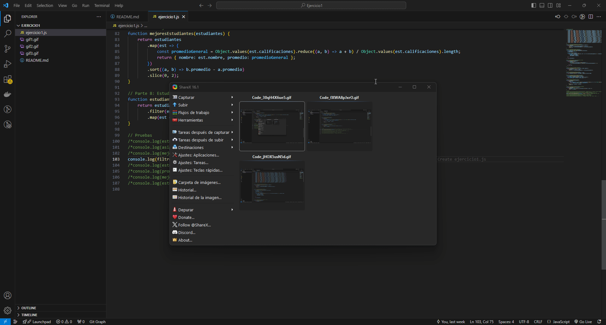

# Ejercicios de Desarrollo Web

## Ejercicio 1: Análisis y Transformación Avanzada de Datos

### Análisis del problema:
Dado un conjunto de datos en forma de array con información sobre estudiantes, sus calificaciones en diferentes asignaturas y detalles adicionales, implementa funciones para analizar, filtrar y transformar estos datos.

### Diseño de la propuesta de solución:
1. **Estructura de datos**: Array de objetos que contienen información de estudiantes.
2. **Funciones requeridas**:
   - Obtener los 3 estudiantes con mejores notas en una asignatura.
   - Identificar la asignatura con el promedio más bajo.
   - Aumentar las notas de estudiantes con beca en un 10% (máximo 10).
   - Filtrar estudiantes por ciudad y asignatura.
   - Contar estudiantes sin beca en una ciudad.
   - Calcular el promedio de edad de estudiantes con beca.
   - Encontrar los 2 estudiantes con el mayor promedio general.
   - Obtener estudiantes que aprobaron todas las materias.

### Implementación del diseño propuesto:
Se desarrollarán varias funciones en JavaScript para realizar las operaciones descritas, utilizando métodos como `map()`, `filter()` y `reduce()` para manipular los datos.

### Pruebas de la resolución del problema:
Se realizarán pruebas manuales para cada función, asegurando que los resultados sean los esperados al invocar las funciones con datos de ejemplo. Para visualizar estas pruebas, se puede consultar el siguiente enlace para un GIF demostrativo: 
 

