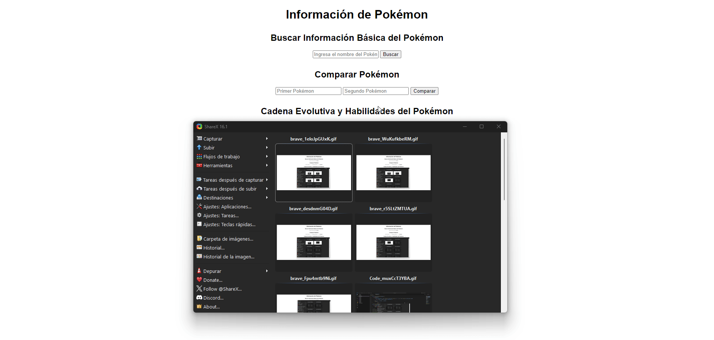

# Ejercicios de Desarrollo Web

## Ejercicio 2: Uso de PokeAPI

### Análisis del problema:
Se requiere interactuar con la PokeAPI para obtener información sobre Pokémon. El objetivo es proporcionar funcionalidades para obtener información básica, comparar estadísticas y listar evoluciones y habilidades de los Pokémon.

### Diseño de la propuesta de solución:
1. **Información Básica del Pokémon**: Realizar una petición a la PokeAPI utilizando el nombre del Pokémon y mostrar su información.
2. **Comparativa de Pokémon**: Permitir al usuario comparar las estadísticas de dos Pokémon.
3. **Evoluciones y Habilidades**: Obtener la cadena evolutiva de un Pokémon específico y listar sus habilidades.

### Implementación del diseño propuesto:
Se desarrollarán funciones en JavaScript para realizar las peticiones a la PokeAPI, manejar las respuestas y mostrar los resultados de manera clara.

### Pruebas de la resolución del problema:

 
---
