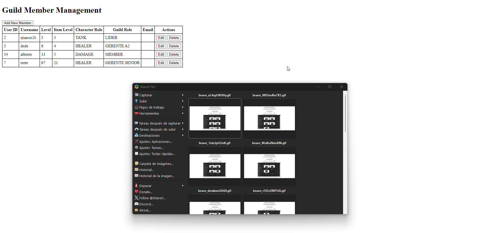
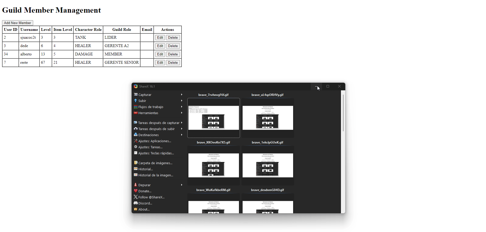
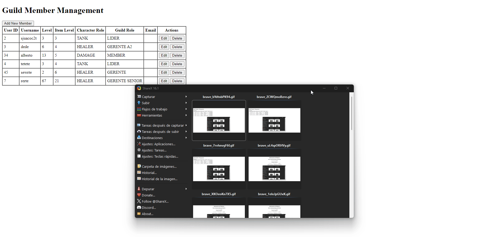
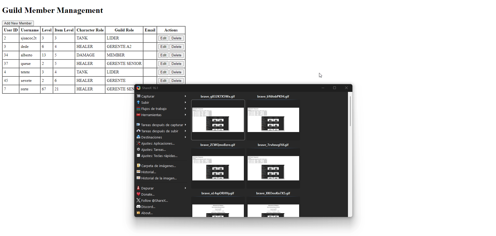
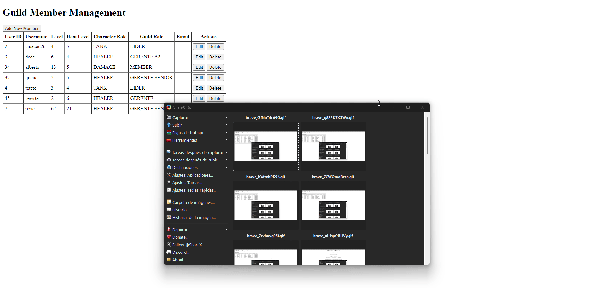
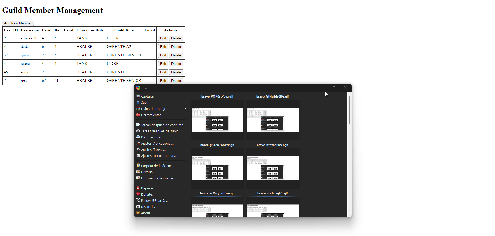

# Ejercicios de Desarrollo Web

## Ejercicio 3: Implementación de CRUD con Modal para "Add New Member" en una Guild

### Análisis del problema:
Se requiere implementar una funcionalidad CRUD (Create, Read, Update, Delete) para gestionar miembros de una guild en un sistema de administración. La interfaz debe permitir visualizar, añadir, editar y eliminar miembros.

### Diseño de la propuesta de solución:
1. *Visualización de Miembros*: Crear una tabla con las columnas User ID, Username, Level, Item Level, Character Role y Guild Role, incluyendo botones de Editar y Eliminar.
2. *Añadir Miembro*: Implementar un botón que abra un modal con un formulario para añadir nuevos miembros.
3. *Editar Miembro*: Permitir editar un miembro existente cargando sus datos en el modal.
4. *Eliminar Miembro*: Implementar un botón que permita eliminar miembros tras confirmación.

### Implementación del diseño propuesto:
Desarrollar funciones en JavaScript para manejar las operaciones CRUD utilizando una API para guardar y obtener la información de los miembros.

### Pruebas de la resolución del problema:
 
 
 
 
 
 

---

## Ejercicio 4: Implementación de un Formulario de Creación de Party en "Party Finder"

### Análisis del problema:
Se necesita un formulario para crear una Party en el sistema "Party Finder", que permita ingresar los detalles necesarios y hacer la solicitud a la API correspondiente.

### Diseño de la propuesta de solución:
1. *Formulario de Creación de Party*: Incluir campos como Party Size, Creator ID, Level Cap, ILevel Cap, Party Role y Planned Start.
2. *Validaciones*: Asegurar que todos los campos sean obligatorios y que el formato de fecha/hora sea correcto.
3. *Interacción con la API*: Enviar los datos del formulario a la API para crear la party.

### Implementación del diseño propuesto:
Desarrollar un formulario en HTML y utilizar JavaScript para manejar las validaciones y el envío de datos a la API.

### Pruebas de la resolución del problema:

 
---

## Ejercicio 5: Gestión Avanzada de Parties con Añadir/Remover Miembros

### Análisis del problema:
Extender la funcionalidad del sistema "Party Finder" para gestionar parties, permitiendo visualizar detalles, añadir y remover miembros.

### Diseño de la propuesta de solución:
1. *Visualización de Parties Creadas*: Mostrar una lista con campos como Party ID, Creator ID, Planned Start, Level Cap y número de miembros.
2. *Añadir Miembros*: Implementar un botón para abrir un modal que permita añadir miembros a una party.
3. *Remover Miembros*: Permitir remover miembros existentes de la party.

### Implementación del diseño propuesto:
Crear una interfaz que permita la gestión de parties y manejar las interacciones con la API para añadir y eliminar miembros.

### Pruebas de la resolución del problema:

 
---