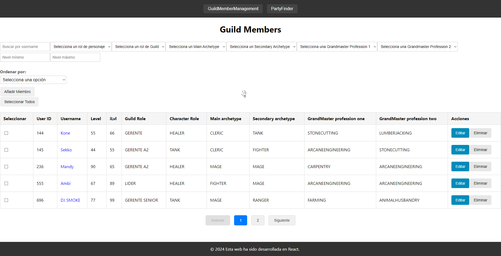
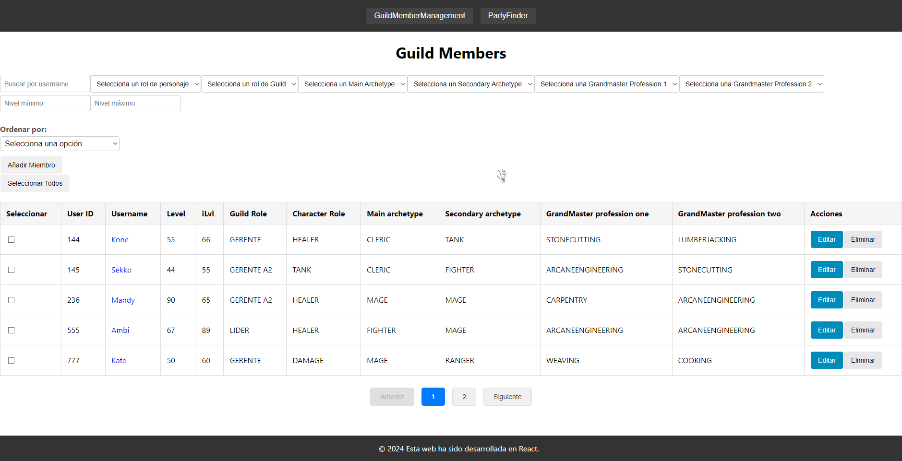
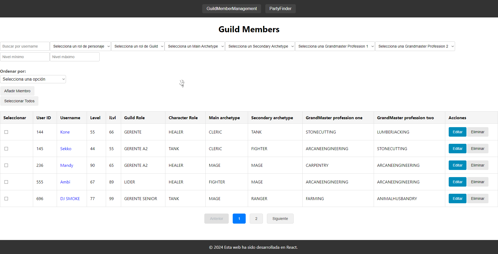
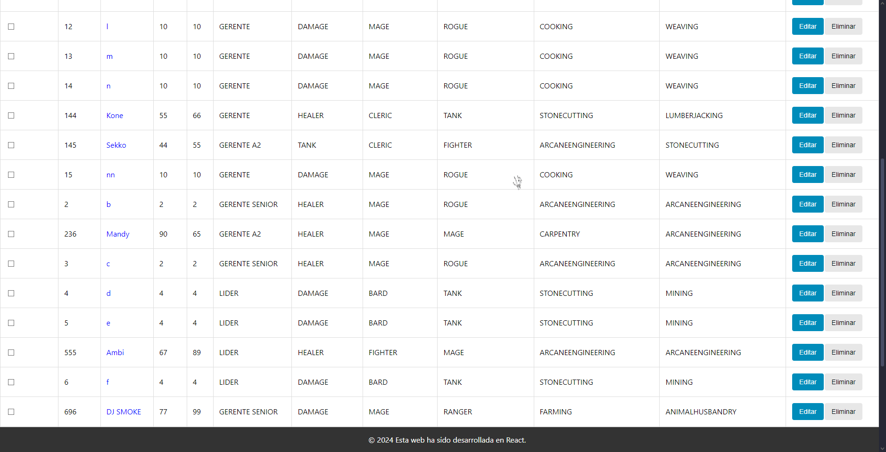

# Ejercicios de Desarrollo Web

## Ejercicio 1: Panel Avanzado de Gestión de Miembros del Gremio

### Contexto:
Este ejercicio se basa en ampliar y mejorar el sistema de gestión de miembros de la guild que ya han implementado previamente. El objetivo es crear un Panel de Gestión de Miembros más avanzado, que permita funcionalidades adicionales como filtrado, ordenamiento, selección múltiple y acciones en lote, proporcionando una interfaz más robusta y eficiente para administrar a los miembros del gremio.

### Requerimientos Funcionales:
1. **Visualización Avanzada de Miembros**:
   - **Tabla de Miembros**:
     - Mostrar todos los miembros del gremio en una tabla dinámica.
     - Incluir las siguientes columnas:
       - `user_id` (integer) (este es único)
       - `username` (string)
       - `level` (integer)
       - `ilvl` (integer)
       - `character_role` (enum: TANK, HEALER, DAMAGE, SUPPORT)
       - `guild_role` (enum: LIDER, GERENTE SENIOR, GERENTE, GERENTE A2, ALPHA 2, MEMBER)
       - `main_archetype` (enum: BARD, CLERIC, FIGHTER, MAGE, RANGER, ROGUE, SUMMONER, TANK)
       - `secondary_archetype` (enum: BARD, CLERIC, FIGHTER, MAGE, RANGER, ROGUE, SUMMONER, TANK)
       - `grandmaster_profession_one` (enum: FISHING, HERBALISM, HUNTING, LUMBERJACKING, MINING, ALCHEMY, ANIMALHUSBANDRY, COOKING, FARMING, LUMBERMILLING, METALWORKING, STONECUTTING, TANNING, WEAVING, ARCANEENGINEERING, ARMORSMITHING, CARPENTRY, JEWELCUTTING, LEATHERWORKING, SCRIBE, TAILORING, WEAPONSMITHING)
       - `grandmaster_profession_two` (enum: FISHING, HERBALISM, HUNTING, LUMBERJACKING, MINING, ALCHEMY, ANIMALHUSBANDRY, COOKING, FARMING, LUMBERMILLING, METALWORKING, STONECUTTING, TANNING, WEAVING, ARCANEENGINEERING, ARMORSMITHING, CARPENTRY, JEWELCUTTING, LEATHERWORKING, SCRIBE, TAILORING, WEAPONSMITHING)
     - Añadir una columna con una casilla de verificación para seleccionar miembros.
     - Cada fila debe tener botones de Editar y Eliminar.

2. **Filtrado y Ordenamiento**:
   - **Barra de Filtros** que permita filtrar a los miembros por:
     - Character Role
     - Guild Role
     - Main Archetype
     - Secondary Archetype
     - Grandmaster Profession (tanto para la 1 como para la 2)
     - Nivel mínimo y máximo
     - Item Level mínimo y máximo
   - Los filtros deben poder combinarse (por ejemplo, filtrar por Character Role y Level mínimo).
   - **Ordenamiento**:
     - Permite ordenar la tabla por cualquiera de las columnas, tanto ascendente como descendente.

3. **Selección Múltiple y Acciones en Lote**:
   - **Selección Múltiple**:
     - Los usuarios pueden seleccionar múltiples miembros utilizando las casillas de verificación.
     - Añadir una casilla de verificación en el encabezado para seleccionar/deseleccionar todos los miembros visibles.
   - **Acciones en Lote**:
     - Cambiar Guild Role: Permite cambiar el rol del gremio de todos los miembros seleccionados a un rol específico.
     - Eliminar Miembros: Permite eliminar a todos los miembros seleccionados (requiere confirmación en una alerta).

4. **Optimización**:
   - **Renderización Eficiente**:
     - Implementar técnicas para evitar renderizaciones innecesarias, mejorando el rendimiento con grandes cantidades de datos.
     - Utilizar `React.memo`, `useMemo`, y `useCallback` cuando sea apropiado.
   - **Paginación**:
     - Implementar paginación de la lista para manejar eficientemente listas con muchos miembros.
     - Poner un selector para decidir si mostrar 10, 20 o 50 miembros.

5. **Detalles de Miembro y Edición**:
   - **Detalle de Miembro**:
     - Al hacer clic en el Username de un miembro, se abre un Modal con detalles completos del miembro.
   - **Edición Mejorada**:
     - El Modal de edición debe permitir actualizar todos los campos del miembro excepto el `user_id`.
     - Implementar validaciones avanzadas:
       - Asegurar que los niveles (Level e ilvl) sean números enteros positivos.
       - Evitar duplicados en `user_id`.

6. **Validaciones y Manejo de Errores**:
   - **Validaciones en Tiempo Real**:
     - Mostrar mensajes de error mientras el usuario completa los formularios si los datos no son válidos.
     - Deshabilitar el botón de enviar hasta que el formulario sea válido.
   - **Manejo de Errores de API**:
     - Mostrar mensajes de error claros si ocurre algún problema al comunicarse con la API.
     - Manejar errores comunes como fallos de red o respuestas con códigos de error.

### Pruebas de la resolución del problema:
1. **Prueba 1: Filtrado Combinado con Ordenamiento y Acciones en Lote**
   - Aplicar múltiples filtros simultáneamente (e.g., Character Role = 'DAMAGE', Guild Role = 'MEMBER', Level entre 50 y 60, Main Archetype = 'MAGE', Grandmaster Profession One = 'ALCHEMY').
   - Ordenar los resultados por ilvl en orden descendente.
   - Seleccionar todos los miembros filtrados utilizando la casilla de verificación en el encabezado.
   - Realizar una acción en lote para cambiar su Guild Role a 'GERENTE'.
   - Verificar que solo los miembros visibles y filtrados se actualizan correctamente y que la paginación refleja los cambios.
   - 

2. **Prueba 2: Edición de Miembro con Validación en Tiempo Real y Manejo de Errores de API**
   - Editar un miembro desde el MemberEditModal e introducir valores inválidos (e.g., Level negativo, ilvl no numérico).
   - Comprobar que las validaciones en tiempo real impiden la sumisión y muestran mensajes de error claros.
   - Simular un fallo en la API al guardar cambios válidos y verificar que el NotificationSystem informa adecuadamente sin afectar la usabilidad.
   - 

3. **Prueba 3: Creación de Miembro con Duplicidad de user_id y Actualización en Tiempo Real**
   - Intentar crear un nuevo miembro con un `user_id` que ya existe.
   - Verificar que el ValidationSystem detecta la duplicidad antes de enviar y muestra un mensaje de error claro.
   - Corregir el `user_id` y completar la creación.
   - Confirmar que el nuevo miembro aparece inmediatamente en la MemberList sin necesidad de recargar.
   - 

4. **Prueba 4: Persistencia y Consistencia al Filtrar, Ordenar y Editar**
   - Aplicar filtros y ordenamientos específicos.
   - Editar un miembro de manera que ya no cumpla con los filtros aplicados (e.g., cambiar su Level fuera del rango filtrado).
   - Comprobar que, tras guardar, el miembro desaparece de la lista filtrada y que la paginación se ajusta correctamente.
   - 

5. **Prueba 5: Paginación Dinámica y Manejo de Cambios en el Conjunto de Datos**
   - Cambiar el número de miembros mostrados por página (10, 20, 50).
   - Navegar a una página específica.
   - Aplicar un filtro que reduce el número total de páginas.
   - Verificar que la aplicación redirige a una página válida y no muestra contenido vacío o errores.
   - 

### Componentes Involucrados:
- **`GuildMemberManagement` (Componente Principal)**:
  - Administra el estado global relacionado con la gestión de miembros.
  - Maneja la comunicación con los componentes secundarios que tiene para que se integren adecuadamente.
- **`FilterBar` (Componente secundario de GuildMemberManagement)**:
  - Componente que contiene los controles para filtrar la lista de miembros con los filtros definidos en la definición funcional.
  - Incluye inputs, selectores y sliders para los diferentes criterios de filtrado indicados en la definición funcional.
- **`SortControls` (Componente secundario de GuildMemberManagement)**:
  - Permite ordenar la lista de miembros por diferentes columnas según lo indicado en la definición funcional.
  - Incluye el evento para aplicar el orden (ascendente/descendente/sin orden).
- **`CreateMember` (Componente secundario de GuildMemberManagement)**:
  - Botón que permite crear un miembro, teniendo en cuenta todas las validaciones especificadas en la definición funcional.
  - Incluye notificaciones y/o validaciones en tiempo real y manejo de errores tal y como se definen en la definición funcional.
- **`MemberList` (Componente secundario de GuildMemberManagement)**:
  - Renderiza la tabla de miembros.
  - Recibe la lista de miembros filtrada y ordenada desde la API del método correspondiente del js del servicio.
  - Implementa el componente de paginación.
- **`Pagination` (Componente secundario de MemberList)**:
  - `Pagination`: Componente para moverse entre páginas de la tabla.
- **`MemberItem` (Componente secundario de MemberList)**:
  - Representa una fila individual en la tabla de miembros.
  - Incluye la información del miembro y los botones de Editar y Eliminar definidos en la definición funcional.
  - Contiene la casilla de verificación para la selección múltiple.
- **`BulkActions` (Componente secundario de MemberItem)**:
  - Aparece para poder seleccionar uno o más miembros.
  - Contiene los botones para las acciones en lote (Cambiar Guild Role o Eliminar Miembros).
  - Maneja la lógica para aplicar las acciones seleccionadas a los miembros seleccionados.
  - Incluye notificaciones y/o validaciones en tiempo real y manejo de errores tal y como se definen en la definición funcional.
- **`MemberDetailsModal` (Componente secundario de MemberItem)**:
  - Muestra información detallada de un miembro. (la misma pero en un modal)
  - Se abre al hacer clic en el Username. (Sólo en el Username)
  - Permite ver información adicional y cerrar el modal.
- **`MemberEditModal` (Componente secundario de MemberItem)**:
  - Modal utilizado para editar la información de un miembro.
  - Llena previamente el formulario con los datos actuales del miembro.
  - Incluye notificaciones y/o validaciones en tiempo real y manejo de errores tal y como se definen en la definición funcional.
