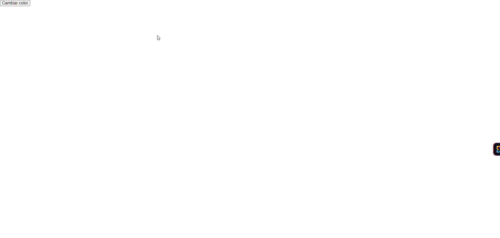

# Ejercicios de Desarrollo Web

## Ejercicio 1: Cambio de Color con Botón

### Análisis del problema:
Se requiere una página web que contenga un botón etiquetado "Cambiar color". Al hacer clic en dicho botón, el color de fondo de la página debe cambiar a un color aleatorio. El objetivo es proporcionar una experiencia interactiva y visualmente dinámica.

### Diseño de la propuesta de solución:
1. **Estructura HTML**: Página con un botón central.
2. **Lógica JavaScript**: Utilizar `Math.random()` para generar colores aleatorios en formato RGB.
3. **Diagrama de flujo**:
   - Inicia -> Clic en el botón -> Generar color aleatorio -> Cambiar el color de fondo -> Fin.

### Implementación del diseño propuesto:
Se desarrollará un archivo HTML con un botón y una pequeña función de JavaScript que cambiará el color de fondo utilizando `Math.random()` para generar los valores RGB aleatorios.

### Pruebas de la resolución del problema:
Pruebas realizadas manualmente clickeando el botón para verificar que el color de fondo cambia cada vez a un color diferente. Se adjuntará un GIF mostrando la interacción.
 
---

## Ejercicio 2: Calculadora de Área

### Análisis del problema:
Se debe diseñar una página web con dos campos de entrada, uno para el ancho y otro para la altura de un rectángulo. Al hacer clic en el botón "Calcular Área", se debe mostrar el área calculada del rectángulo en un párrafo dentro de la página.

### Diseño de la propuesta de solución:
1. **Estructura HTML**: Dos campos de entrada y un botón para calcular el área.
2. **Lógica JavaScript**: Multiplicar el ancho y la altura para obtener el área y mostrarlo en el párrafo correspondiente.
3. **Diagrama de flujo**:
   - Inicia -> Usuario introduce ancho y alto -> Clic en el botón -> Calcular área -> Mostrar resultado -> Fin.

### Implementación del diseño propuesto:
Se implementará un archivo HTML con dos campos de entrada para el ancho y el alto. En JavaScript, se capturarán los valores de los inputs, se calculará el área y se mostrará en un párrafo.

### Pruebas de la resolución del problema:
Pruebas manuales introduciendo diferentes valores de ancho y alto, verificando que el resultado sea correcto. Se incluirá un GIF mostrando el funcionamiento.

---

## Ejercicio 3: Listado Dinámico

### Análisis del problema:
Se debe crear una página con un campo de entrada y un botón "Añadir a la lista". Cada vez que el usuario escriba algo y haga clic en el botón, el contenido debe agregarse como un nuevo elemento en una lista vacía.

### Diseño de la propuesta de solución:
1. **Estructura HTML**: Un campo de entrada, un botón y una lista vacía.
2. **Lógica JavaScript**: Capturar el texto del input y añadirlo a la lista mediante `.createElement()` y `.appendChild()`.
3. **Diagrama de flujo**:
   - Inicia -> Usuario introduce texto -> Clic en el botón -> Crear nuevo item -> Añadir a la lista -> Fin.

### Implementación del diseño propuesto:
Se creará una página HTML con un input y un botón. En JavaScript, se gestionará la lógica para tomar el valor del campo de entrada y añadirlo a una lista dinámica.

### Pruebas de la resolución del problema:
Pruebas realizadas añadiendo varios ítems a la lista, verificando que se agreguen correctamente. Se proporcionará un GIF que muestre el proceso.

---

## Ejercicio 4: Hover y Estilo Dinámico

### Análisis del problema:
Se debe diseñar una página con varios elementos `div`, cada uno con un texto diferente. Cuando el usuario pase el ratón sobre un `div`, su color de fondo debe cambiar a azul y el texto a blanco. Al mover el ratón fuera del `div`, los estilos deben restaurarse.

### Diseño de la propuesta de solución:
1. **Estructura HTML**: Múltiples `div` con textos diferentes.
2. **Lógica CSS/JavaScript**: Utilizar los eventos `mouseover` y `mouseout` para cambiar los estilos dinámicamente.
3. **Diagrama de flujo**:
   - Inicia -> Mouse sobre un `div` -> Cambiar estilos -> Mouse fuera -> Restaurar estilos -> Fin.

### Implementación del diseño propuesto:
La página contendrá varios `div` con texto. Se utilizará JavaScript o CSS para manejar los eventos `mouseover` y `mouseout` que alterarán los estilos del `div`.

### Pruebas de la resolución del problema:
Pruebas realizadas pasando el ratón sobre los `divs` para verificar que los estilos cambian correctamente. Se proporcionará un GIF demostrativo.

---

## Ejercicio 5: Detección de Clics y Generación de XPath

### Análisis del problema:
Se debe desarrollar una página web que detecte clics en cualquier elemento y muestre el XPath único del elemento clickeado en un cuadro de alerta o en una sección específica de la página.

### Diseño de la propuesta de solución:
1. **Estructura HTML**: Página con varios elementos sobre los que se pueda hacer clic.
2. **Lógica JavaScript**:
   - Capturar el clic en cualquier elemento de la página.
   - Determinar el elemento clickeado utilizando `event.target`.
   - Generar el XPath correspondiente y mostrarlo.
3. **Diagrama de flujo**:
   - Inicia -> Clic en elemento -> Capturar `event.target` -> Generar XPath -> Mostrar XPath -> Fin.

### Implementación del diseño propuesto:
Se añadirá un evento de escucha al documento completo para capturar los clics en cualquier parte de la página. Se desarrollará una función para calcular el XPath del elemento clickeado y mostrarlo en una alerta o una sección específica de la página.

### Pruebas de la resolución del problema:
Pruebas realizadas clickeando diferentes elementos en la página y verificando que el XPath se genere correctamente. Se incluirá un GIF mostrando este comportamiento.

---
