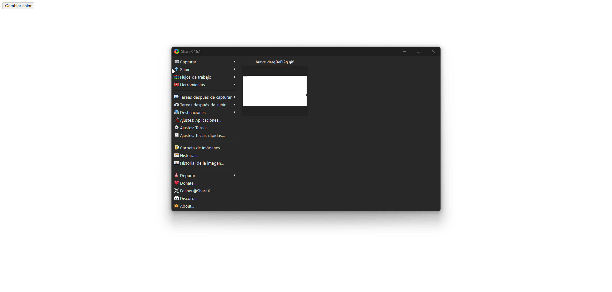

# Ejercicio 1: Cambio de Color con Botón

Este ejercicio consiste en una página web simple que contiene un botón etiquetado como "Cambiar color". Al hacer clic en el botón, el color de fondo de la página cambia a un color aleatorio.

## Descripción del Funcionamiento

- Al cargar la página, el usuario verá un botón en el centro de la pantalla que dice "Cambiar color".
- Al presionar el botón, el color de fondo del `body` cambia aleatoriamente utilizando valores RGB generados con `Math.random()`.

### Archivos incluidos

1. **ejercicio1.html**: Archivo HTML que contiene la estructura básica de la página.
2. **ejercicio1.js**: Archivo JavaScript que maneja la lógica para generar colores aleatorios y cambiar el color de fondo de la página.


### Prueba del Ejercicio

Aquí puedes ver un vídeo en formato GIF que muestra el funcionamiento correcto del botón al cambiar el color de fondo:



---

### Ejemplo de Código JavaScript para Cambiar el Color

```javascript
function generarColorAleatorio() {
    const r = Math.floor(Math.random() * 256);
    const g = Math.floor(Math.random() * 256);
    const b = Math.floor(Math.random() * 256);
    return `rgb(${r}, ${g}, ${b})`;
}

document.getElementById("colorButton").addEventListener("click", () => {
    document.body.style.backgroundColor = generarColorAleatorio();
});


# Ejercicio 2: Calculadora de Área

Este ejercicio consiste en una página web que permite al usuario calcular el área de un rectángulo. El usuario ingresará el ancho y el alto del rectángulo, y al hacer clic en el botón "Calcular Área", se mostrará el resultado en la página.

## Descripción del Funcionamiento

- Al cargar la página, el usuario verá dos campos de entrada (input) para ingresar el ancho y el alto del rectángulo.
- Al presionar el botón "Calcular Área", se calcula el área utilizando la fórmula: 
  \[
  \text{Área} = \text{ancho} \times \text{alto}
  \]
- El resultado se mostrará en un elemento `<p>` debajo del botón.

### Archivos incluidos

1. **ejercicio2.html**: Archivo HTML que contiene la estructura básica de la página.
2. **ejercicio2.js**: Archivo JavaScript que maneja la lógica para calcular el área y mostrar el resultado en la página.

### Prueba del Ejercicio

Aquí puedes ver un vídeo en formato GIF que muestra el funcionamiento correcto de la calculadora al calcular el área:


### Ejemplo de Código HTML y JavaScript para Calcular el Área

**ejercicio2.html**
```html
<!DOCTYPE html>
<html lang="es">
<head>
    <meta charset="UTF-8">
    <meta name="viewport" content="width=device-width, initial-scale=1.0">
    <title>Calculadora de Área</title>
    <link rel="stylesheet" href="estilos.css">
</head>
<body>
    <h1>Calculadora de Área</h1>
    <input type="number" id="width" placeholder="Ancho" required>
    <input type="number" id="height" placeholder="Alto" required>
    <button id="calcularButton">Calcular Área</button>
    <p id="resultado"></p>
    
    <script src="ejercicio2.js"></script>
</body>
</html>

