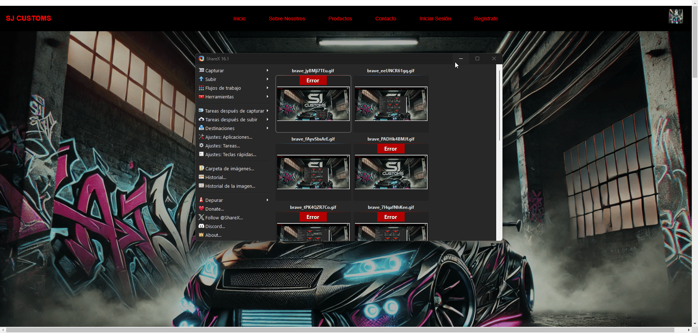
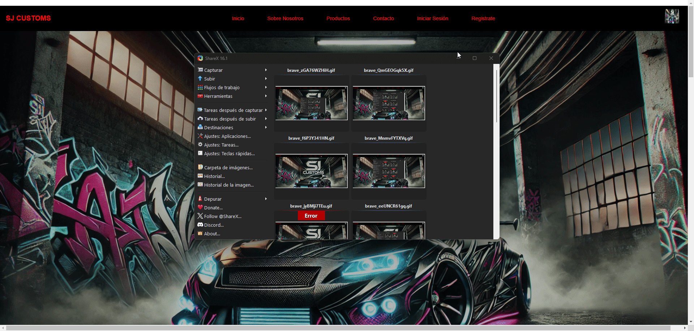
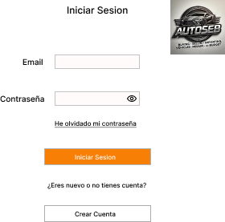
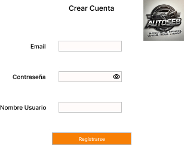
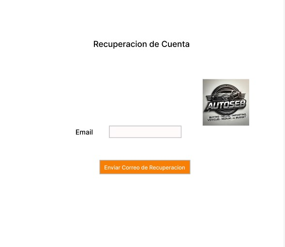
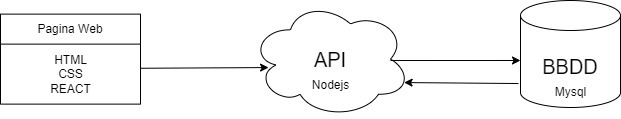

## Ejercicios

### 📌 Ejercicio 1: Implementación de la Pantalla de Inicio (Home)

#### 🎯 Contexto
Desarrollar una Pantalla de Inicio funcional, adaptable y estéticamente atractiva, con los elementos mínimos requeridos según la categoría del proyecto seleccionada.

#### ⚙️ Elementos Mínimos independientes de la categoría
1. 🔝 Barra de Navegación (Navbar)
2. 🖼️ Sección Principal (Hero Section)
3. 📄 Listado Dinámico de Contenido (Content List)
4. 📄 Detalle Resumido del Contenido (Content Card)
5. 📝 Pie de Página (Footer)

### 🛒 Categoría 3: Sitio de Ventas (Salesforce / Shopify)

#### ⚙️ Elementos Específicos
1. Barra de Filtros Avanzados (ProductFilter.jsx)
   - Filtros por categoría, precio, marca y valoración.
2. Tarjetas de Producto (ProductCard.jsx)
   - Es el uso del “ContentCard.jsx” pero para unos de datos concretos.
   - Imagen del producto, nombre, precio y botón Añadir al carrito, Abrir Chat o Abrir Configurador.
3. Resumen de Carrito (CartPreview.jsx), Chat de Venta o Pantalla del Configurador
   - Icono de carrito con resumen de productos añadidos.

#### 🧪 Pruebas Funcionales independientemente de la categoría
- ✅ Prueba: Comprobación de elementos mínimos y específicos
  - Navegar a la pantalla de Home.
  - Comprobar que aparecen los elementos mínimos y específicos definidos anteriormente con el detalle descrito en los diferentes enumerados.
    Prueba1
      

### 📌 Ejercicio 2: Implementación de Módulos de Autenticación (Login, Registro y Recuperación de Contraseña)

#### 🎯 Contexto
El objetivo de este ejercicio es desarrollar un sistema de autenticación completo para la aplicación web. Se deben implementar los componentes de Login, Registro y Recuperación de Contraseña con validaciones avanzadas, interacción con la API mockeadas y una experiencia de usuario fluida y segura.

#### ⚙️ Requerimientos Funcionales
1. Formulario de Inicio de Sesión (Login)
   - **Campos:**
     - Correo Electrónico (Email)
     - Contraseña (Password)
     - Casilla de "Recordarme" (Remember Me)
   - **Botones:**
     - Iniciar Sesión
     - ¿Olvidaste tu contraseña? (Redirige al formulario de recuperación)
   - **Validaciones:**
     - El correo debe tener un formato válido.
     - La contraseña no puede estar vacía.
     - Mostrar errores en tiempo real.
   - **Flujo de Inicio de Sesión:**
     - Al hacer clic en Iniciar Sesión, se debe validar el formulario.
     - Si las credenciales son correctas (Poner por defecto el valor 4dA1Ts_2425), redirigir al panel principal.
     - Si hay error (credenciales inválidas), mostrar mensaje claro mediante el NotificationSystem.
2. Formulario de Registro (Register)
   - **Campos:**
     - Nombre de Usuario (Username)
     - Correo Electrónico (Email)
     - Contraseña (Password)
     - Confirmar Contraseña
   - **Botones:**
     - Registrarse
     - ¿Ya tienes una cuenta? Inicia Sesión (Redirige al formulario de login)
   - **Validaciones:**
     - Email con formato válido.
     - La contraseña debe tener al menos 8 caracteres, incluir una mayúscula, un número y un símbolo.
     - Confirmar que ambas contraseñas coinciden.
     - Verificación de duplicidad de correo o usuario mediante la API.
     - Validaciones en tiempo real.
   - **Flujo de Registro:**
     - Al registrarse correctamente, mostrar notificación de éxito y redirigir al login.
     - Si ocurre un error (simularlo a mano), mostrar notificación de error.
3. Formulario de Recuperación de Contraseña (Forgot Password)
   - **Campos:**
     - Correo Electrónico (Email)
   - **Botones:**
     - Enviar Enlace de Recuperación
     - Volver al Inicio de Sesión
   - **Validaciones:**
     - El correo debe tener un formato válido.
     - Verificar si el correo está registrado.
   - **Flujo de Recuperación:**
     - Al enviar el formulario, se debe enviar una solicitud a la API (pintar por consola lo que se mandaría en la llamada) para enviar el enlace de recuperación.
     - Mostrar notificación de éxito si se envía el correo.
     - Mostrar error si el correo no está registrado o si falla la API. (simularlo a mano)

#### 🧪 Pruebas a Realizar
- ✅ Prueba 1: Inicio de Sesión Correcto
  - Ingresar un correo y contraseña válidos.
  - Hacer clic en Iniciar Sesión.
  - Verificar que el usuario es redirigido al panel principal.
  - Confirmar notificación de éxito.
- ❌ Prueba 2: Error en Inicio de Sesión
  - Ingresar credenciales incorrectas.
  - Verificar que aparece una notificación de error.
- 🆕 Prueba 3: Registro con Validaciones
  - Ingresar datos inválidos (correo incorrecto, contraseñas que no coinciden).
  - Verificar que se muestran mensajes de error en tiempo real.
  - Corregir los datos y completar el registro.
  - Verificar notificación de éxito y redirección al login.
- 🔐 Prueba 4: Recuperación de Contraseña
  - Ingresar un correo registrado.
  - Verificar que se envía un correo de recuperación.
  - Probar con un correo no registrado y verificar el mensaje de error.

Prueba 1

Prueba 2

Prueba 3

Prueba 4

## DISEÑO

