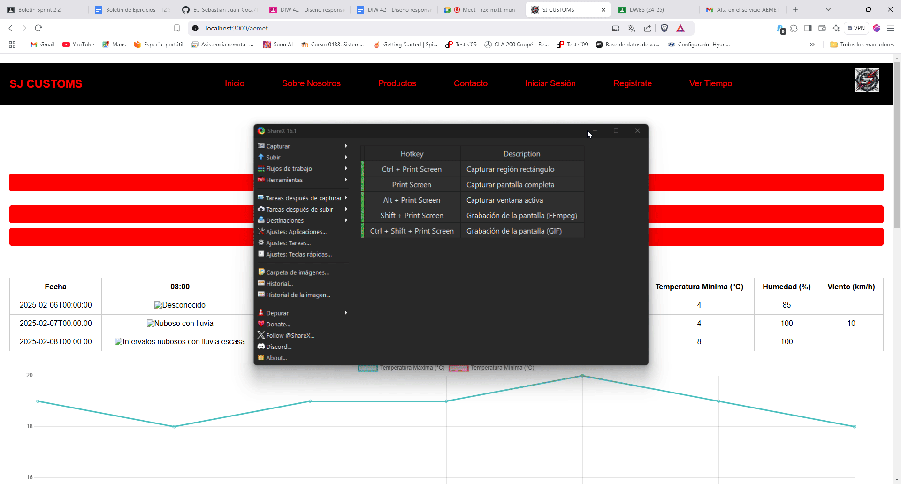

## Descripción del ejercicio

Para asentar los conocimientos mostrados en la parte teórica, se tendrá que proceder a resolver los siguientes ejercicios/problemas en el orden correcto. Para ello, primero pasamos a explicar los criterios que debemos seguir para la resolución de los ejercicios/problemas.

### Fases de la resolución de problemas

1. **Análisis del problema**: Se debe indicar en el directorio específico de la asignatura el problema que se va a resolver de una forma adecuada, es decir, no debe contener ambigüedades, debe ser simple y autocontenido.
2. **Diseño de la propuesta de solución del problema**: Como todo aquel problema que se quiere resolver, es necesario realizar el diseño de la o las soluciones que se procederá a implementar en el siguiente paso. Para esto nos debemos ayudar de las herramientas para realizar esquemas gráficos (UML, Diagramas de flujos, etc…).
3. **Implementación del diseño propuesto**: En este punto ya se procederá a implementar todo el diseño establecido en el punto anterior.
4. **Pruebas de la resolución del problema**: Es indispensable el realizar pruebas para verificar la integridad y correcto funcionamiento de la implementación realizada, para ello simplemente compararemos si el comportamiento esperado del análisis del problema se ha implementado de forma adecuada.

### 📌 Ejercicio 1: Implementación de una Web del Tiempo con la API de AEMET

#### 🎯 Contexto

El objetivo de este ejercicio es desarrollar una aplicación web del tiempo que permita a los usuarios consultar información meteorológica de diferentes ubicaciones de España, utilizando la API de AEMET (Agencia Estatal de Meteorología).

La interfaz estará inspirada en la web de [eltiempo.es](https://www.eltiempo.es/sevilla.html), proporcionando datos detallados como:
- Estado actual del tiempo.
- Pronóstico por horas y días.
- Mapa meteorológico interactivo.
- Índices de calidad del aire y avisos meteorológicos.

#### ⚙️ Requerimientos Funcionales

1️⃣ **Consulta del tiempo actual por provincia**
- Introducción de la ubicación en un buscador (sólo por provincia).
- Visualización del estado actual (temperatura, condición climática y velocidad del viento).
- Iconos dinámicos según la condición climática (soleado, nublado, lluvia, etc.).

2️⃣ **Pronóstico detallado por horas y días**
- Representación visual de la evolución del tiempo (gráficos de temperatura, precipitaciones, etc.).
- Predicción por días con intervalos de mañana (8:00), tarde (15:00) y noche (21:00).
- Predicción de mínimo 48 horas, es decir, dos días posterior al actual.

#### 🔗 Documentación de la API de AEMET

Para obtener los datos meteorológicos, se utilizará la API de AEMET, que proporciona información detallada sobre el clima en tiempo real y pronósticos.

- **Registro y obtención de API Key**:
  - Acceder a AEMET API y obtener la clave de acceso.
  - Usar POSTMAN para verificar manualmente la llamada al endpoint.
- **Seguir la documentación de SWAGGER**:
  - Acceder a AEMET API SWAGGER para obtener toda la información relevante a volcar en Postman para verificar el correcto funcionamiento de nuestra petición.

#### ✅ Pruebas a realizar

- **Prueba 1: Consulta de provincia y visualización de datos actuales**
  - Ingresar Sevilla en el filtro de provincia.
  - Verificar que se muestra la temperatura, el estado del clima (lluvioso, soleado, o nublado) y la velocidad del viento actual.
  - Verificar que se muestra la temperatura, el estado del clima (lluvioso, soleado, o nublado) y la velocidad del viento pronosticada en al menos las siguientes 48 horas.
  - Ingresar Madrid en el filtro de provincia.
  - Verificar que se muestra la temperatura, el estado del clima (lluvioso, soleado, o nublado) y la velocidad del viento actual.
  - Verificar que se muestra la temperatura, el estado del clima (lluvioso, soleado, o nublado) y la velocidad del viento pronosticada en al menos las siguientes 48 horas.

  

- **Prueba 2: Cambio entre unidades de temperatura**
  - Cambiar de Celsius a Fahrenheit.
  - Confirmar que los valores se actualizan correctamente.

  

### 📌 Ejercicio 2: Funcionalidades Interactivas por Categoría

El objetivo de este ejercicio es que el alumnado desarrolle funcionalidades interactivas avanzadas basadas en su categoría de proyecto. Se espera que implementen componentes reutilizables que permitan mejorar la experiencia del usuario mediante dashboards, comparadores, rankings, planificadores o encuestas.

Cada categoría del proyecto incluye tres funcionalidades clave, que deben ser desarrolladas siguiendo las buenas prácticas de modularidad y reutilización de código.

#### 🛒 Categoría 3: Sitio de Ventas (Salesforce / Shopify)

##### ⚙️ Descripción de las funcionalidades

1️⃣ **Comparador de Productos**
- Comparación de productos según precio, valoraciones y especificaciones técnicas.
- Posibilidad de seleccionar múltiples productos y visualizar sus diferencias clave.

2️⃣ **Sistemas de Encuestas o Votaciones**
- Encuestas de satisfacción post-compra o interacción de “me gusta”.
- Votaciones para determinar los productos mejor valorados en distintas categorías o visualización de los productos con más “me gusta”.

3️⃣ **Simuladores de Decisiones/configuraciones**
- Configuración personalizada de productos según necesidades del usuario (colores, tuning, motor, etc.).
- Recomendaciones de productos con base en preferencias seleccionadas.

##### 🧪 Pruebas a realizar

- **Prueba 1: Comparación de productos**
  - Seleccionar al menos dos productos para comparar.
  - Verificar que las diferencias clave se resaltan correctamente.

  

- **Prueba 2: Encuestas y votaciones**
  - Completar una encuesta de satisfacción.
  - Validar que los votos se registran correctamente y afectan la clasificación.

  

- **Prueba 3: Simulación de decisión de compra**
  - Configurar un producto utilizando distintos parámetros.
  - Verificar que las recomendaciones son coherentes con la configuración elegida.

  

