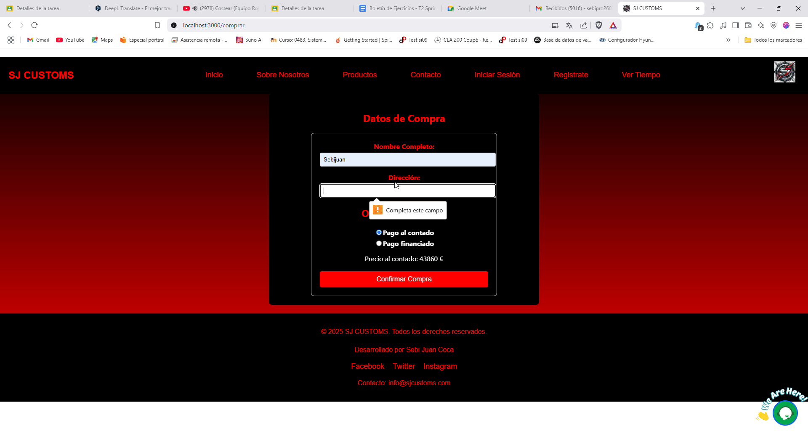
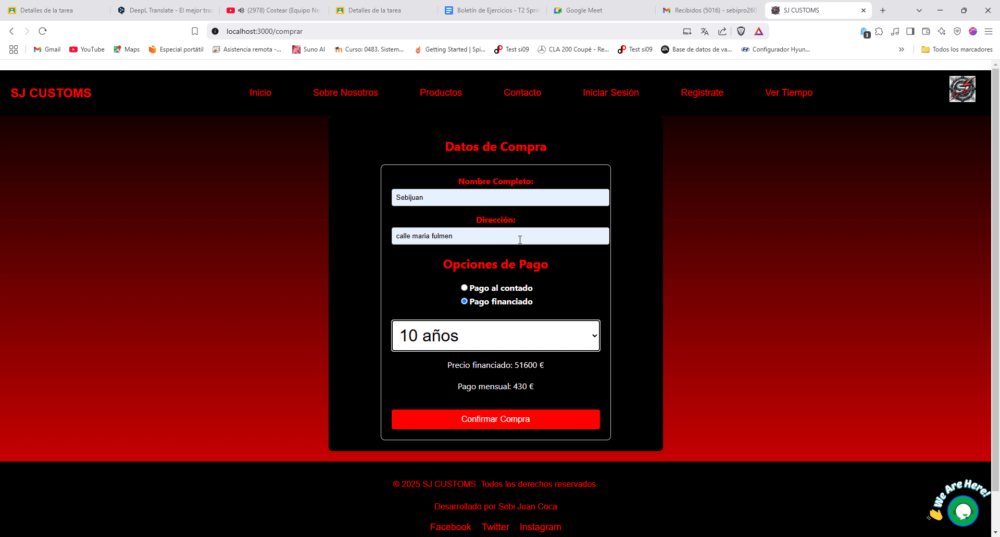

## Descripción del ejercicio

### 📌 Ejercicio 3: FUNCIONALIDAD LIBRE

El objetivo de este ejercicio es que el/la alumno/a proponga tres nuevas funcionalidades para su proyecto web, alineadas con los objetivos de su categoría, y que sigan una metodología estructurada de desarrollo. Cada funcionalidad deberá estar bien fundamentada y documentada en historias de usuario, con sus respectivos criterios de aceptación, diseño propuesto, implementación y pruebas.

#### 🔸 Historia de Usuario 1: Apartado de Contacto

**📝 Descripción:**
"Como usuario del sitio web, quiero poder enviar un mensaje a través del apartado de contacto para que el equipo de soporte pueda recibir mis dudas o comentarios por correo electrónico."

**🔸 Criterios de Aceptación**
- Dado que un usuario desea contactar al equipo de soporte, la funcionalidad deberá permitir el ingreso de su nombre, correo electrónico y mensaje de manera clara y accesible.
- Cuando el usuario envíe el formulario con datos válidos, el sistema deberá enviar un correo electrónico con la información ingresada al equipo de soporte.
- Entonces, el usuario deberá recibir una confirmación en pantalla indicando que su mensaje ha sido enviado de manera exitosa.

**🔸 Diseño**
- **🎨 Mockups:**
  - Formulario con campos para nombre, correo electrónico y mensaje.
  - Botón de "Enviar" con validaciones de campos requeridos.
  - Mensaje de éxito tras enviar el formulario.
- **⚙ Integración con funcionalidades existentes:**
  - Validaciones en frontend para evitar el envío de formularios vacíos.
  - Envío de correo desde el backend utilizando una API o servicio SMTP.

**🔸 Implementación**
- **📌 Modificaciones en código:**
  - Creación de un formulario en la UI.
  - Backend con una función que capture los datos del formulario y los envíe por correo electrónico.
  - Validaciones en frontend y backend.

**🔸 Pruebas**
- **🔍 Caso de prueba 1: Validación de campos obligatorios**
  - Dado que el usuario intenta enviar el formulario vacío, entonces el sistema deberá mostrar un mensaje de error indicando que todos los campos son obligatorios.
  - 
- **🔍 Caso de prueba 2: Envío exitoso del mensaje**
  - Cuando el usuario complete todos los campos correctamente y haga clic en "Enviar", entonces el sistema deberá mostrar una confirmación de envío exitoso.
  - 
- **🔍 Caso de prueba 3: Comprobar que el Correo Llegue**
  - Comprobar que llegue el mensaje del usuario a la bandeja de entrada del equipo de soporte técnico.
  - 

#### 🔸 Historia de Usuario 2: Chat de Mecánico

**📝 Descripción:**
"Como usuario del sitio web, quiero poder realizar consultas a un mecánico a través de un chat en tiempo real para recibir asesoramiento sobre problemas con mi vehículo."

**🔸 Criterios de Aceptación**
- Dado que un usuario necesita asistencia mecánica, la funcionalidad deberá permitir abrir una ventana de chat en la página para iniciar una conversación con un mecánico.
- Cuando el usuario envíe un mensaje en el chat, el sistema deberá entregarlo al mecánico en tiempo real y mostrar la respuesta cuando esté disponible.
- Entonces, el chat deberá permitir una conversación fluida mostrando los mensajes enviados y recibidos de manera clara y ordenada.

**🔸 Diseño**
- **🎨 Mockups:**
  - Botón flotante en la página para abrir el chat.
  - Ventana de chat con campo de texto para escribir mensajes y un botón de "Enviar".
  - Indicador de "Mecánico en línea" o "Mecánico no disponible".
- **⚙ Integración con funcionalidades existentes:**
  - Uso de WebSockets o Firebase para comunicación en tiempo real.
  - Notificaciones cuando el mecánico responde.
  - Opción de registrar el historial de chat para futuras referencias.

**🔸 Implementación**
- **📌 Modificaciones en código:**
  - Creación del componente de chat en el frontend.
  - Configuración de WebSockets o Firebase en el backend para manejo de mensajes.
  - Almacenamiento de consultas en la base de datos.

**🔸 Pruebas**
- **🔍 Caso de prueba 1: Apertura del chat**
  - Dado que el usuario hace clic en el botón del chat, entonces el sistema deberá mostrar la ventana de chat correctamente.
  - 
- **🔍 Caso de prueba 2: Envío y recepción de mensajes**
  - Cuando el usuario envíe un mensaje en el chat, entonces el mecánico deberá recibirlo y responder en tiempo real.
  - 
- **🔍 Caso de prueba 3: Guardar Conversaciones anteriores con un Agente**
  - Dado que podemos abrir varios chats, deberíamos poder ver las anteriores conversaciones, es decir, se pide que se guarde anteriores conversaciones o abrir más de un chat.
  - 

#### 🔸 Historia de Usuario 3: Simulador de Compra

**📝 Descripción:**
"Como usuario del sitio web, quiero poder simular la compra de un producto ingresando mis datos de contacto y eligiendo un método de pago (financiado o al contado) para conocer las condiciones antes de finalizar la compra."

**🔸 Criterios de Aceptación**
- Dado que el usuario quiere comprar un producto, la funcionalidad deberá permitir ingresar sus datos de contacto (nombre, correo, teléfono) antes de proceder con la simulación.
- Cuando el usuario elija un método de pago (financiado o al contado), el sistema deberá calcular y mostrar el costo total, incluyendo cuotas e intereses en caso de financiamiento.
- Entonces, al confirmar la simulación, el usuario deberá ver un resumen detallado de la compra y tener la opción de proceder al pago o solicitar más información.

**🔸 Diseño**
- **🎨 Mockups:**
  - Formulario con campos para ingresar datos de contacto.
  - Selector de método de pago con opciones de "Financiado" o "Al contado".
  - Cálculo dinámico del precio según la opción elegida.
  - Botón de "Confirmar Simulación" que muestra un resumen antes de continuar con el pago.
- **⚙ Integración con funcionalidades existentes:**
  - Conexión con pasarelas de pago para simular el proceso de pago.
  - Almacenamiento de datos de contacto en la base de datos para seguimiento.

**🔸 Implementación**
- **📌 Modificaciones en código:**
  - Creación de formulario interactivo en frontend.
  - Backend que recibe los datos y calcula el costo según la opción de pago.
  - Integración con API de pago si el usuario desea proceder con la compra.

**🔸 Pruebas**
- **🔍 Caso de prueba 1: Ingreso de datos de contacto**
  - Dado que el usuario accede al simulador, entonces el sistema deberá validar que los campos de contacto sean obligatorios antes de continuar.
  - 
- **🔍 Caso de prueba 2: Cálculo de precio según método de pago**
  - Cuando el usuario seleccione "Financiado", entonces el sistema deberá calcular y mostrar las cuotas con sus respectivos intereses.
  - 
- **🔍 Caso de prueba 3: Confirmación de la simulación**
  - Dado que el usuario confirma la simulación, entonces el sistema deberá mostrar un mensaje o pantalla de confirmación.
  - 

